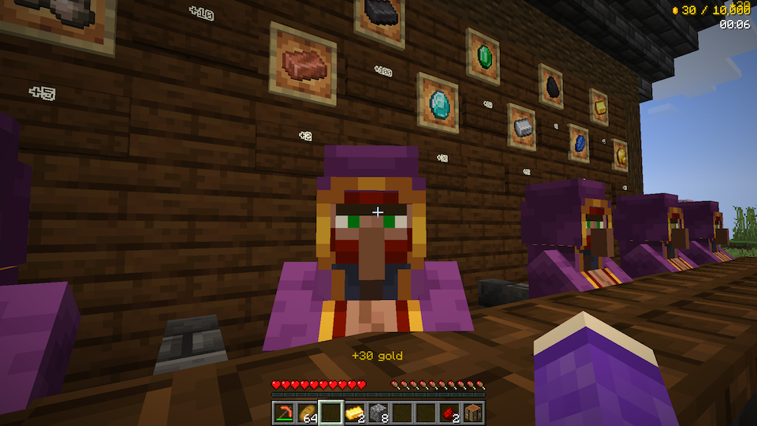

# Miner's Market

**A competitive mining mod for Minecraft**

Compete to strike it rich — mine ores, sell to the merchant, and be the first to earn 10,000 gold! Built with Architectury for cross-platform support (Fabric + NeoForge/Forge).



## Features

- **Competitive Mining**: Race against other players to be the first to earn 10,000 gold
- **NPC Merchant**: Sell your mined ores and ingots to a merchant NPC at the market
- **Auto-Generated Market**: A market structure spawns automatically at the world spawn point
- **Miner's Pickaxe**: A powerful custom pickaxe with Fortune III, high durability (4096), and fast mining speed
- **Price Events**: Dynamic price fluctuations occur every 10 minutes, lasting 3–5 minutes — sell at the right time for maximum profit!
- **Real-Time HUD**: Track your earnings, play time, rankings, price events, and market direction on screen
- **Multiplayer Support**: Designed for competitive multiplayer sessions with rankings and finish notifications

## Supported Versions

| Minecraft | Mod Loader | Dependencies |
|-----------|-----------|--------------|
| 1.21.10 | Fabric Loader 0.18.4+ with Fabric API 0.138.4+1.21.10 | Architectury API 18.0.8+ |
| 1.21.10 | NeoForge 21.10.64+ | Architectury API 18.0.8+ |
| 1.21.9 | Fabric Loader 0.18.4+ with Fabric API 0.134.1+1.21.9 | Architectury API 18.0.3+ |
| 1.21.9 | NeoForge 21.9.16-beta+ | Architectury API 18.0.3+ |
| 1.21.8 | Fabric Loader 0.18.4+ with Fabric API 0.136.0+1.21.8 | Architectury API 17.0.8+ |
| 1.21.8 | NeoForge 21.8.52+ | Architectury API 17.0.8+ |
| 1.21.7 | Fabric Loader 0.18.4+ with Fabric API 0.129.0+1.21.7 | Architectury API 17.0.8+ |
| 1.21.7 | NeoForge 21.7.25-beta+ | Architectury API 17.0.8+ |
| 1.21.6 | Fabric Loader 0.18.4+ with Fabric API 0.128.2+1.21.6 | Architectury API 17.0.6+ |
| 1.21.6 | NeoForge 21.6.20-beta+ | Architectury API 17.0.6+ |
| 1.21.5 | Fabric Loader 0.18.4+ with Fabric API 0.126.0+1.21.5 | Architectury API 16.1.4+ |
| 1.21.5 | NeoForge 21.5.96+ | Architectury API 16.1.4+ |
| 1.21.4 | Fabric Loader 0.18.4+ with Fabric API 0.119.3+1.21.4 | Architectury API 15.0.3+ |
| 1.21.4 | NeoForge 21.4.156+ | Architectury API 15.0.3+ |
| 1.21.3 | Fabric Loader 0.16.10+ with Fabric API 0.107.3+1.21.3 | Architectury API 14.0.4+ |
| 1.21.3 | NeoForge 21.3.95+ | Architectury API 14.0.4+ |
| 1.21.1 | Fabric Loader 0.17.3+ with Fabric API 0.116.7+1.21.1 | Architectury API 13.0.8+ |
| 1.21.1 | NeoForge 21.1.209+ | Architectury API 13.0.8+ |
| 1.20.1 | Fabric Loader 0.16.10+ with Fabric API 0.92.2+1.20.1 | Architectury API 9.2.14+ |
| 1.20.1 | Forge 47.3.0+ | Architectury API 9.2.14+ |

## Requirements

### For Players
- **Minecraft**: Java Edition 1.20.1–1.21.10
- **Mod Loader** (choose one):
  - **1.21.1–1.21.10**: Fabric with Fabric API, or NeoForge
  - **1.20.1**: Fabric with Fabric API, or Forge
- **Dependencies**:
  - Architectury API (see Supported Versions table for version requirements)

### For Developers
- **Java Development Kit (JDK)**: 21 for 1.21.1+, 17 for 1.20.1 (auto-downloaded by toolchain)
- **IDE**: IntelliJ IDEA (recommended) or Eclipse

## Building from Source

```bash
git clone https://github.com/ksoichiro/MinersMarket.git
cd MinersMarket

# Build for a specific version
./gradlew build -Ptarget_mc_version=1.21.1
./gradlew build -Ptarget_mc_version=1.20.1

# Build all supported versions
./gradlew buildAll

# Full release (clean + buildAll + collectJars)
./gradlew release
```

**Output Files** (examples):
- `fabric-<version>/build/libs/minersmarket-*-fabric.jar` - Fabric JAR
- `neoforge-<version>/build/libs/minersmarket-*-neoforge.jar` - NeoForge JAR (1.21.1+)
- `forge-1.20.1/build/libs/minersmarket-*-forge.jar` - Forge JAR (1.20.1)

## Development Setup

### Import to IDE

#### IntelliJ IDEA (Recommended)
1. Open IntelliJ IDEA
2. File → Open → Select `build.gradle` in project root
3. Choose "Open as Project"
4. Wait for Gradle sync to complete

### Run in Development Environment

```bash
# Fabric client (target version determined by gradle.properties or -P flag)
./gradlew :fabric:runClient

# NeoForge client (1.21.1)
./gradlew :neoforge:runClient

# Forge client (1.20.1)
./gradlew :forge:runClient -Ptarget_mc_version=1.20.1
```

## Installation

1. Install the desired Minecraft version
2. Install a supported mod loader (see [Supported Versions](#supported-versions) for details)
3. Download and install the required Fabric API (Fabric only) and Architectury API
4. Copy the corresponding Miner's Market JAR to `.minecraft/mods/` folder
5. Launch Minecraft with the mod loader profile

## Project Structure

```
MinersMarket/
├── common-shared/           # Shared version-agnostic sources (included via srcDir)
├── common-<version>/        # Common module per MC version (version-specific APIs)
├── fabric-base/             # Shared Fabric sources
├── fabric-<version>/        # Fabric subproject per MC version
├── neoforge-base/           # Shared NeoForge sources
├── neoforge-<version>/      # NeoForge subproject per MC version (1.21.1+)
├── forge-base/              # Shared Forge sources
├── forge-1.20.1/            # Forge subproject for MC 1.20.1
├── props/                   # Version-specific properties
├── build.gradle             # Root build configuration (Groovy DSL)
├── settings.gradle          # Multi-module settings
└── gradle.properties        # Version configuration
```

## Technical Notes

- **Build DSL**: Groovy DSL (for Architectury Loom compatibility)
- **Mappings**: Mojang mappings (official Minecraft class names)
- **Shadow Plugin**: Bundles common module into loader-specific JARs
- **Persistence**: Uses `SavedData` to track game state across server restarts

## License

This project is licensed under the **GNU Lesser General Public License v3.0 (LGPL-3.0)**.

Copyright (C) 2025 Soichiro Kashima

See the [COPYING](COPYING) and [COPYING.LESSER](COPYING.LESSER) files for full license text.

## Credits

- Built with [Architectury](https://github.com/architectury/architectury-api)

## Support

For issues, feature requests, or questions:
- Open an issue on [GitHub Issues](https://github.com/ksoichiro/MinersMarket/issues)

---

**Developed for Minecraft Java Edition 1.20.1–1.21.10**
